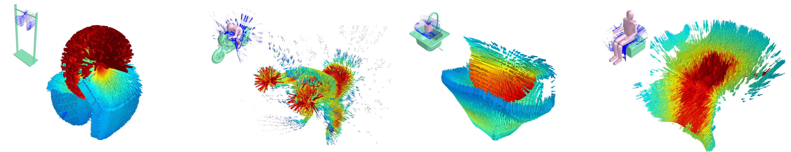

# Geometric Affordances from a Single Example via the Interaction Tensor 

### Introduction



The interaction tensor is a tensor field representation to express the *geometric* affordance of one object relative to another, a key competence for Cognitive and Autonomous robots. We expand the bisector surface representation to one that is weight-driven and that retains the provenance of surface points with directional vectors. We also incorporate the notion of *affordance keypoints* which allow for faster decisions at a point of query and with a compact and straightforward descriptor. Using a single interaction example, we are able to generalize to previously-unseen scenarios; both synthetic and also real scenes captured with RGB-D sensors. Evaluations also include crowd-sourcing comparisons that confirm the validity of our affordance proposals, which agree on average 84% of the time with human judgments, which is 20-40% better than the baseline methods.

This work is based on our ICRA'18 paper. You can find arXiv version of the paper [here](https://arxiv.org/abs/1703.10584).

#### Citation 
If you find our work useful in your research, please consider citing:

    @INPROCEEDINGS{ruiz2018,
    title={Geometric Affordances from a Single Example via the Interaction Tensor},
    author={Ruiz Eduardo and Mayol-Cuevas Walterio},
    booktitle={Robotics and Automation (ICRA), 2018 IEEE International Conference on},
    year={2018},
    month={May},
    }
    
### Getting Started

The code here provided includes comments on the most relevant sections. I strongly suggest you give a read to the paper, specifically section III, where the parameters and steps involved in the computation for the interaction tensor (iT) are explained.

The code was developed using C++ and has been tested under Ubuntu 16.04 and CUDA 8.0, Qt 5 was also used to develop the GUI for *training*. During the code development a few extra scripts were written in matlab but in order to keep everything free-licensed I wrote them as well in C++. The original scripts are also provided in case you have access to a matlab license.

#### Prerequisites

A script is provided in order to install the PCL version used to develop the code (1.8 trunk). This script assumes that the NVIDIA driver and CUDA are already installed in your PC. If you don't have these, I suggest you follow the instructions [here](https://docs.nvidia.com/cuda/cuda-installation-guide-linux/index.html "NVIDIA")

The script will create a directory inside the current path where some dependencies will be downloaded (qhull, VTK, PCL source, OPENNI, etc). Everything is set to be installed in the standard path **/usr/local/**.

At the time this script was created **qhull** source files had some issues, these cause the installation to fail. Instructions to fix these issues are written inside the installation script, but in any case they are as follows.

#### Fix qhull installation
Compiler will complain that math functions are not found. Need to fix manually the linking flag in Makefile for libqhull, open Makefile and move -lm to the end of the line, for each line that uses it.

```
cd src/libqhull
nano Makefile
```
Save and then compile and install:
```
make && make install
```
The same goes for libqhull_r. Open Makefile and move -lm to the end of the line, for each line that uses it. 
```
cd ../libqhull_r/ 
nano Makefile
```
Additionally, this library needs also a path correction in file **rbox_r.c** so:
```
nano rbox_r.c
```
And modify the include from "libqhull/random_r.h" to "random_r.h", save and then:
```
make && make install
```
If you had to make the fix then the installation needs to be completed by compiling and installing PCL, go back to the installation root (aPCL directory) and 

```
cd pcl-trunk
source ~/.bashrc
mkdir build && cd build
cmake -DBUILD_GPU=ON -DBUILD_CUDA=ON -DBUILD_gpu_kinfu=OFF -DBUILD_examples=OFF -DBUILD_OPENNI2=ON -DBUILD_examples=ON -DPCL_VERSION=1.8 -DWITH_VTK=ON -DWITH_QT=ON ..
make -j4 && sudo make install
```

### GUI for training examples

We provide a simple GUI in order to compute affordance training examples. This tool essentially allows you to load two pointclouds or CAD models (PLY, OBJ) and compute their interaction tensor. It also computes all the files required to later perform affordance predictions. Here I only provide source code to compile, if you want to learn more on how to make such GUIs for PCL and QT, have a look at [this PCL tutorial](http://pointclouds.org/documentation/tutorials/qt_visualizer.php "PCL and QT")

The code for the training GUI is under Traning/src. I suggest you create a directory called build and compile there. 

```
cd Training
mkdir build && cd build/
cmake ../src
make
```

This process will create a binary file called newGUI, you can edit this target name in the src/CMakeLists.txt file if you wish.

Instruction for computing interaction tensors given two pointclouds or CAD models can be found [HERE](Training/README.md)
## Code Author

* **Eduardo Ruiz** - [University of Bristol](http://www.bris.ac.uk/engineering/people/eduardo-d-ruiz-libreros/index.html)
