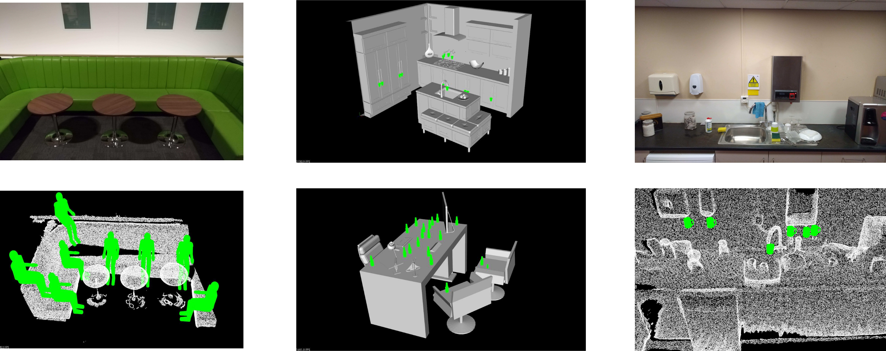

## Affordance prediction with the Interaction Tensor



We provide c++ source code to test the interaction tensor for affordance prediction. The code is under **Testing/src**, you can compile by doing:


```
cd Testing/
mkdir build && cd build
cmake ../src
make
```

That will create 3 main files files and the shared libraries. The main files you will need are:

1. tensorTest
2. meshSampling
3. convert_pcd_ascii_binary

The one named *tensorTest* is the one you need to make affordace location prediction. The remaining one contains some auxiliary code which is explained further below

Essentially,  you need a query-object and affordance that have been *trained* as well as an input scene where to look for affordance canidadate locations. This scene can be a pointcloud from a synthetic model or
a pointcloud obtained with a depth sensor (PCD file).

For example, in order to make affordance predictions for *Placing* a *bowl* in a synthetic kitchen scene (file called kitchen5.ply) you need to call the code as follows:


```
./tensorTest Place bowl kitchen5.ply
```

The code will look for all the relevant files under the **data/** directory by default. These files comprised the *training* data, the input scene file and one parameters file.

In principle you can change the location of the files by providing the scene file with its path. For instance:
```
./tensorTest Place bowl /home/user/Documents/kitchen5.ply
```

will use /home/user/Documents instead of the **data/** to look for all the files needed to run (relative paths are OK too). The only requirement is that you keep the following structure

```
+-- _data
|   +-- parameters.txt
|   +-- kitchen5.ply
|	+-- kitchen5_d.pcd
|	+--_Place
	|	+-- bowl.ply
	|	+-- ibs_full_Place_bowl.pcd
	|	+-- ibs_full_Place_bowl.txt
	|	+-- ...
|	+--_Fill
	|	+-- mug.ply
	|	+-- ibs_full_Fill_mug.pcd
	|	+-- ibs_full_Fill_mug.txt
	|	+-- ...
	.
	.
	.
```

Notice that the this structure contains the **Place** directory created during training, so you just need to copy the contents generated during training into your data folder. Also notice that there are two scene files in this example: kitchen5.ply and **kitchen5_d.ply**. The former is a sparse "regular" CAD model of a kitchen whereas the latter is a dense pointcloud created from that model. It is important to have at least the dense file, the CAD model is used only for displaying results. In the last subsection you can find info on how to produce a dense pointcloud for your scene files.

**Important**: PCL GPU libraries need binary compressed pointclouds to work, so you need to convert your scene pointclouds to this encoding otherwise the code will crash, see below convert_pcd_ascii_binary for help.

The code will produce a few files with the data from the predictions and sampled points, the main file has the base name:
```
[affordance]_[query-object]_[scene]_3D_[orientations]_[predictionThreshold]_13_[timeStamp].pcd
```
So, in the case of the previous example it would be somthing like: Place_bowl_kitchen5_3D_8_50_13_[timeStamp].pcd

The data files are:
* timeStamp_samplePoints.pcd: 3D coordinates of test-points sampled from the scene.
* timeStamp_goodPoints.pcd: 3D coordinates of good locations and encoded in RGB values the number of good predictions for each point.
* timeStamp_goodPointsX.pcd: Score, affordance_id and orientation_id of good predictions.

Notice that files share the same time stamp to make it easier to store and keep track of results/runs.

#### Parameters.txt

This file controls important parameters and thresholds of the code. For the current version of the code you only need to pay attention to the following lines:

4. Sample: Percentage of points to test in the input scene
5. Debug: *Verbosity* of the output during run.
	* 0 -> No viewer, text only. Terminal shows progress of the run.
	* 1 -> Viewer showing scene and best-to-date affordance prediction
	* 2 -> Viewer showing scene and pausing at every good prediction. Terminal shows timings and extra info about pointclouds
9. PredictionT: Score threshold to consider a prediction as good.

In newer releases (coming soon) we added some extra functionalities which are controlled by the other lines in this file. For now you should just ignore them as they won't affect the code.

#### meshSampling

Our approach needs needs dense pointclouds, if you have CAD model of a scene that want to test (PLY/OBJ file) you can use *meshSampling* to sample points uniformly over the faces (triagulation)
of the CAD model. This is essentially the code you can find in the PCL examples with the voxelization disabled so you can set the number of points you want in your final pointlcloud. 

Syntax is:
``` 
./meshSampling input.{ply,obj} output.pcd <options>
```
where options are:
* -n_samples X =number of points in the final pointcloud (default 1000000)

#### convert_pcd_ascii_binary

As mentioned earlier PCL GPU functions need binary compressed pointclouds. If you have a pointcloud (created with meshSampling or your own) you can use *convert_pcd_ascii_binary* to solve this issue.
Similarly to *meshSampling* this code is available in the PCL examples but we provide it for your convinience The syntax is as follows:
```
./convert_pcd_ascii_binary <file_in.pcd> <file_out.pcd> 0/1/2 (ascii/binary/binary_compressed) [precision (ASCII)
```

Here you would need to use 2 as the third parameter.